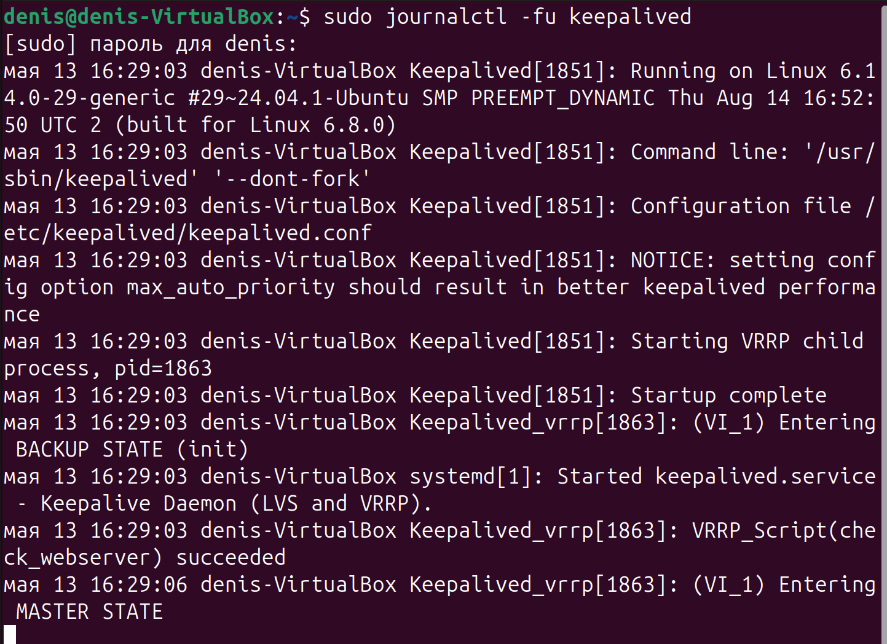
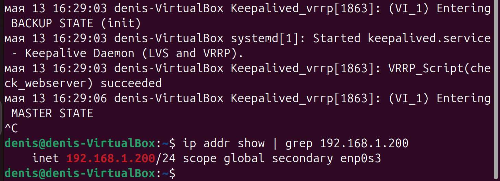

# Домашнее задание к занятию «Disaster recovery и Keepalived» - Мурашов Денис

## Задание 1

Настроил отслеживание интерфейса Gi0/0 для группы 1 на обоих маршрутизаторах.

## Задание 2

Файлы: check_webserver.sh, keepalived.conf

